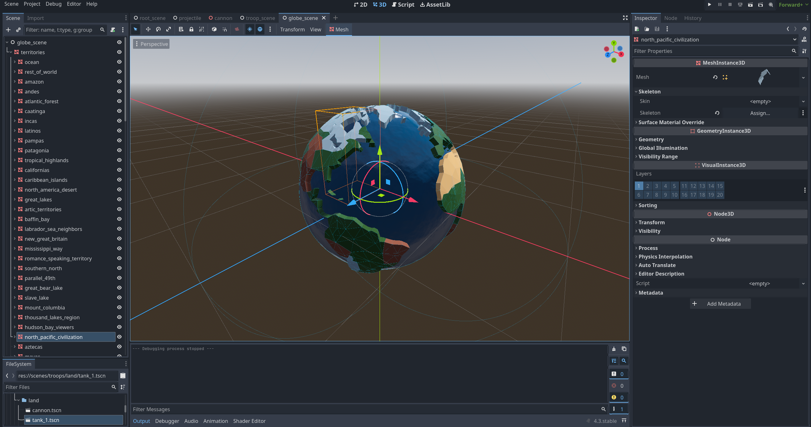

# Expansionists

[](https://godotengine.org)
[](https://www.rust-lang.org/)

**Expansionists** is a strategy game of global conquest, built with the Godot Engine and Rust. Command your troops, expand your empire, and dominate the world.

This project is currently in (ON and OFF) development.

## 🌍 About The Project

Inspired by classic world domination board games, Expansionists brings the battle to a 3D globe. The core game logic is powered by Rust for performance and safety, integrated into Godot 4 via GDExtension.

- [Private Kanban Board](https://trello.com/b/5sQdN0i1/expansionists-%F0%9F%8C%8E)



### 🎮 Demo: Expanding and Occupying Lands


### 🎮 Demo: In Progress Combat


### Features (Planned/In-Progress)
*   3D globe for world map interaction.
*   A variety of land and sea units (Tanks, Cannons, Galleons, and more).
*   Territory-based resource and troop management.
*   Turn-based or real-time strategy combat.

## 🛠️ Built With

*   [Godot Engine v4.3](https://godotengine.org/)
*   [Rust](https://www.rust-lang.org/)
*   [godot-rust (gdext)](https://github.com/godot-rust/gdext)

## 🚀 Getting Started

To get a local copy up and running, follow these steps.

### Prerequisites

*   **Rust Toolchain**: Make sure you have `rustup` and `cargo` installed.
    ```sh
    curl --proto '=https' --tlsv1.2 -sSf https://sh.rustup.rs | sh
    ```
*   **Godot Engine**: Download Godot v4.3 or newer.
    *   Godot Website

### Installation & Running

1.  **Get to the codebase folder**
    ```sh
    cd expansionists/codebase
    ```

2.  **Build the Rust Library**
    Navigate to the `rust` directory and build the project. This compiles the Rust code into a dynamic library that Godot will use.
    ```sh
    cd rust
    cargo build
    ```
    The build script will automatically place the compiled library (`.dll`, `.so`, or `.dylib`) into the `godot/bin/` directory.

3.  **Open in Godot**
    *   Launch the Godot Engine editor.
    *   Choose **Import** or **Scan** and select the `codebase/godot` folder.
    *   Open the "Expansionists" project from the project manager.

4.  **Run the Game**
    *   With the project open in Godot, press `F5` or click the **Play** button in the top-right corner to start the game.

## 📂 Project Structure

The project is split into two main parts:

*   `codebase/godot/`: Contains all Godot-related files, including scenes (`.tscn`), resources (`.tres`), assets (models, textures), and the main `project.godot` file.
*   `codebase/rust/`: The Rust crate containing the core game logic, managed by Cargo. It's compiled as a GDExtension for use in Godot.

## 📧 Contact

Lucas - @luhalvesbr - hey@luhalvesbr.dev

Project Link: https://github.com/molotov-drinkers/expansionists/
